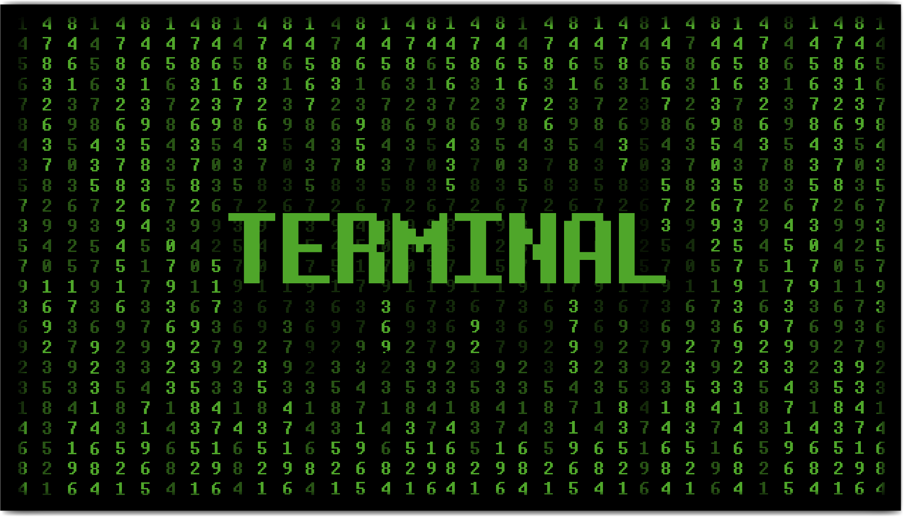
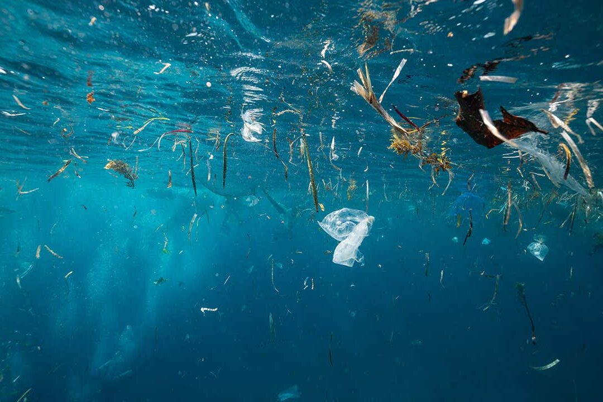
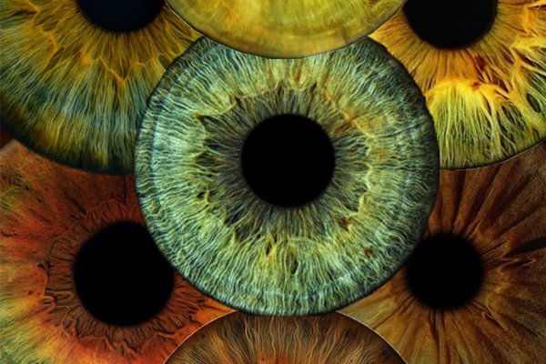
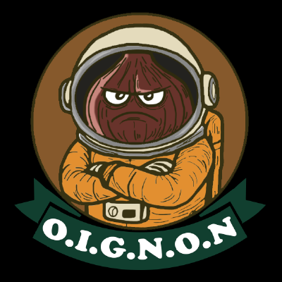
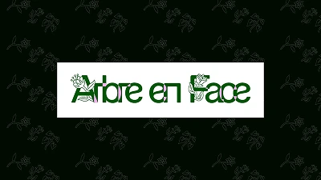
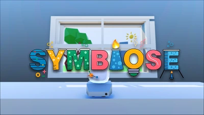

Site Web de l'exposition du cours 582-601 Expérience multimédia en techniques d'intégration multimédia du Collège Montmorency : [tim-montmorency.com/2026](http://tim-montmorency.com/2026)

<h2 style="text-align: center;">Projets étudiants</h2>

- 
- 
- 
- 
- 
- 
